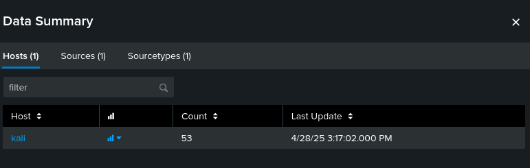
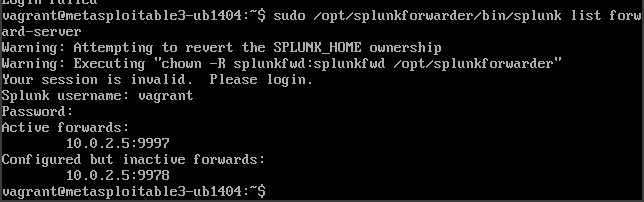

# Splunk SIEM and Forwarder Installation Guide

This guide details the steps for installing Splunk Enterprise Server (SIEM) and the Splunk Universal Forwarder on Linux systems. This setup is commonly used to collect logs from various sources (like honeypots) and push them in Splunk for analysis and monitoring.

## Step 1: Install Splunk Enterprise Server (SIEM)

These steps are for installing the main Splunk Server instance, which will receive and process logs from the forwarders.

### Download Splunk Server .deb Package:

Use wget to download the Splunk Enterprise server package. Replace the URL if you need a different version or architecture.

```bash
wget -O splunk-9.3.2-d8bb32809498-linux-2.6-amd64.deb https://download.splunk.com/products/splunk/releases/9.3.2/linux/splunk-9.3.2-d8bb32809498-linux-2.6-amd64.deb
```


### Install the Splunk Server Package:

Install the downloaded .deb package using dpkg.

```bash
sudo dpkg -i splunk-9.3.2-d8bb32809498-linux-2.6-amd64.deb
```


### Fix Broken Dependencies (if needed):

If the installation fails due to missing dependencies, run this command to install them.

```bash
sudo apt --fix-broken install
```

### Start Splunk for the First Time:

Start the Splunk service. You will be prompted to accept the license agreement during the first start.

```bash
sudo /opt/splunk/bin/splunk start --accept-license
```


### Start Splunk in The Web


## Step 2: Splunk Universal Forwarder Installation (Agent)

This section covers installing the Splunk Universal Forwarder, which acts as an agent on systems (like your victim or honeypot device) to collect and send logs to the Splunk Server. Run these commands on the device you want to collect logs from.

### Download Splunk Forwarder:

First:

- Go Settings → Forwarding and receiving → Receive data → Configure receiving (if 9997 is not there add it).
- Set Port to 9997 and Save.


#### Note: First we will install it on the attacker machine to get the logs of the attack and then for the victim. They have the same initial steps

Download the Splunk Universal Forwarder package using wget. Ensure you download the correct package for your system's architecture:

```bash
wget -O splunkforwarder-9.4.1-e3bdab203ac8-linux-amd64.deb "https://download.splunk.com/products/universalforwarder/releases/9.4.1/linux/splunkforwarder-9.4.1-e3bdab203ac8-linux-amd64.deb"
```

### Install the Forwarder Package:

Install the downloaded .deb package using dpkg.

```bash
sudo dpkg -i splunkforwarder-9.4.1-e3bdab203ac8-linux-amd64.deb
```

### Fix Any Broken Dependencies:

If the installation encounters dependency issues, run this command.

```bash
sudo apt --fix-broken install
```

### Start Splunk Forwarder and Accept the License:

Start the Universal Forwarder service. You will need to accept the license agreement on the first run.

```bash
sudo /opt/splunkforwarder/bin/splunk start --accept-license
```

In the victim machine:

 


## Step 3: Configure Splunk Forwarder

### Connect Forwarder to Splunk Server:

```bash
sudo /opt/splunkforwarder/bin/splunk add forward-server 127.0.0.1:9997
```

### Add Data Inputs (Log Files):

```bash
sudo /opt/splunkforwarder/bin/splunk add monitor /var/log/auth.log
```

In the attacker I got an error

I did the following:

1. Install rsyslog:
```bash
sudo apt install rsyslog
```

2. Enable and start rsyslog:
```bash
sudo systemctl enable --now rsyslog
```

3. Verify /var/log/auth.log exists:
```bash
ls -l /var/log/auth.log
```


Note: Replace admin:YourPass with your kali actual credentials (if it did not work try splunk credentials - I closed my terminal accidentally I don't remember which one I used):

4. Add the auth.log monitor with proper indexing:
```bash
sudo /opt/splunkforwarder/bin/splunk add monitor /var/log/auth.log \
-index os \
-sourcetype linux_secure \
-auth admin:YourPass
```

5. Enable Splunk to start on system boot:
```bash
sudo /opt/splunk/bin/splunk enable boot-start --accept-license --answer-yes
```

6. Start Splunk service:
```bash
sudo systemctl start splunk
```

7. Add splunkfwd user to adm group (for log access):
```bash
sudo usermod -aG adm splunkfwd
```

8. Check auth.log permissions:
```bash
ls -l /var/log/auth.log
```

9. Verify splunkfwd user ID:
```bash
id splunkfwd
```

10. Ensure splunkfwd is in adm group:
```bash
sudo usermod -aG adm splunkfwd
```

Restart the Universal Forwarder (to pick up the new group membership):

11. Restart the forwarder:
```bash
sudo /opt/splunkforwarder/bin/splunk restart
```

In order to check the logs:

12. Add an index for operating system logs:
```bash
sudo /opt/splunk/bin/splunk add index os
```

In the first terminal:

13. Monitor auth.log:
```bash
sudo tail -f /var/log/auth.log
```

Second terminal:

14. Clear sudo credentials:
```bash
sudo -k
```

15. Try to access root directory:
```bash
sudo ls /root
```

Note: In the first terminal you should see new lines added

In the data summary you should see something like this:



Additionally:

Later on to do further analysis I added proftp logs to monitor the FTP connections. It turned out that only checks my machine and not the victim machine.

I added it manually on splunkforwarder input.conf file:


Here is a sample test for it if you did curl 127.0.0.1 and in another terminal opend the log with tail to monitor the change you will get the following:


#### Victim

### Connect Forwarder to Splunk Server:

```bash
sudo /opt/splunkforwarder/bin/splunk add forward-server 10.0.2.15:9997
```

### Add Data Inputs (Log Files):

```bash
sudo /opt/splunkforwarder/bin/splunk add monitor /var/log/auth.log
```


Before going to the next step an honorable mention:

I did not know that we should add Splunkforwarder to the victim VM. So I did the following:

- Go Settings → Data → add a TCP port
- Set Port to 1814 and Save.

This will enable splunk to listen to any data made by TCP connection on this port.

Next:

Installing vim cause why not:

```bash
sudo apt install vim
```


Next:

Create a new file:


Next:

Open the file to write the following. This will forward everything except auth/authpriv to Splunk over TCP:


After this you will get:


## Step 4: Verify the Setup

After installing the forwarder, verify that it is configured to send data to your Splunk Server.

### Check the Forwarder Status:

Use the splunk list forward-server command to see which Splunk servers the forwarder is configured to send data to.

```bash
sudo /opt/splunkforwarder/bin/splunk list forward-server
```


Victim:



# Log Visualization:

The exploit enables me to run command on the victim machine by the following:


As you can see it returns the same value as a log from the attacker machine.


I used this as a proof that the attack is working as you can see here:


Here is a pattern analysis showing DHCPREQUEST which changes the victim IP address from its main address to a new one. This happened when I run the exploit to open a new CLI in the victim machine.

Also, after running my exploit.py script it shows that FTP session closed and Open are showing multiple times with the port 10.0.2.5 which is the main machine (attacker) IP Address.


Following graph showing how many FTP session Open happened over time.


Attacker log:

At first as I mentioned earlier I thought that I could capture the attack FTP session attack from my machine. For example, after the attack ends I get FTP session opened.

But the logger did not work like this. Every time I run the exploit file, it will just launch a new process for it. Thus, I added a new lines in the exploit file to monitor the attack execution:

```python
MESSAGES = [
    "ATTACK STARTED",
    "PAYLOAD DELIVERED",
    "SHELL TRIGGERED",
    "ATTACK COMPLETE"
]

def send_logger(msg):
    cmd = f"logger \"{msg}\""
    url = WEB_PATH + "?cmd=" + urllib.parse.quote(cmd)
    try:
        with urllib.request.urlopen(url, timeout=5) as resp:
            print(f"[+] Logged: {msg} (HTTP {resp.status})")
    except Exception as e:
        print(f"[!] Failed to log '{msg}': {e}", file=sys.stderr)
```


This chart shows the logs with completed connection.


# Attack Comparison:

Pattern Log for the victim machine.


Attacker Pattern log:


