## 📖 Table of Contents

1️⃣ [Group Members](#group-members)  
2️⃣ [Project Overview](#project-overview)  
3️⃣ [Objectives](#objectives)  
4️⃣ [Tools & Technologies](#tools-and-technologies)  
5️⃣ [Deliverables](#deliverables)  
6️⃣ [Repository Structure](#repository-structure)  
7️⃣ [Licensing](#licensing)  

# ICS344 Information Security Course Project – Group 05

## Group Members

| Name              | Student ID     | Contribution |
|-------------------|----------------|----------------|
| Mohammed Darwish   |  201952590          | Phases 2, 3 |
| Hayder Aleissa   | 202020460           | Phases 1, 3 |

---

## Project Overview

This project, part of KFUPM's ICS344 "Information Security" course, revolves around understanding system vulnerabilities, simulating real-world cyberattacks, and deploying effective defense mechanisms.

The project is divided into **three major phases**:

1. **Phase 1** – Setup and Compromise: Build a vulnerable service and simulate an attack using tools like Metasploit and a custom script.
2. **Phase 2** – SIEM Dashboard Analysis: Use a SIEM tool (Splunk) to visualize and analyze logs.
3. **Phase 3** – Defensive Strategy: Implement and validate security measures to defend against attacks.

---
## Objectives

- Recreate a real-world cyberattack in a controlled environment.
- Explore the inner workings of vulnerable systems and common exploits.
- Leverage SIEM tools to detect, monitor, and visualize attack behavior.
- Formulate an effective defense strategy and demonstrate its impact.

---

## Tools and Technologies

- **VirtualBox** / **VMware**
- **Metasploitable3** (Victim)
- **Kali Linux** (Attacker)
- **Metasploit Framework**
- **Custom Python/Bash Exploitation Script**
- **Splunk SIEM**
- **Windows Services (e.g., SMB, FTP, HTTP)**

---

## Deliverables

- ✅ Environment setup walkthrough and configuration
- ✅ Successful exploitation using Metasploit
- ✅ Custom attack script with proof-of-concept
- ✅ SIEM dashboard with full log visualization
- ✅ Proposed and implemented security defense
- ✅ Before and After security comparisons

---

## Repository Structure

```mermaid
graph TD;
    A[ICS344-Project] --> B[README.md 📝 Main documentation]
    A --> C[phase-1/ 🔥 Attack & Exploitation]
    C --> C1[README.md]

    
    A --> D[phase-2/ 📊 SIEM & Log Analysis]
    D --> D1[README.md]


    A --> E[phase-3/ 🛡️ Security Patches & Validation]
    E --> E1[README.md]

```

    
---

## Licensing

This repository is developed as part of the KFUPM ICS344 course (semester 242) and is intended solely for educational purposes.

